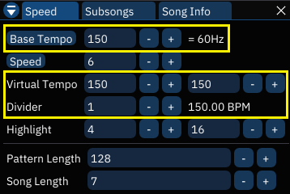
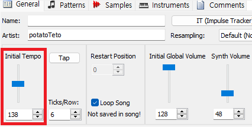

# Synchronizing with Maxmod

It is possible to synchronize advgm playback with [Maxmod](https://codeberg.org/blocksds/maxmod),
so that you can use PCM channels along with the PSG channels for your music.

## Preparing music

Maxmod only allows `*.it`, `*.xm`, `*.s3m`, `*.mod` as the input module,
so you need to use *two different trackers* to create a combined music.

Obviously, two modules must have the same order of patterns/rows/speed and loop points to be synced properly.

What's not obvious is that **you need to set the tempo to 150 for the Furnace module when exporting VGM, regardless of the target tempo**.\
This includes virtual tempo too, so just make sure that every tempo field is filled with 150 when exporting VGM:

For the Maxmod tracker module, on the other hand, you would want to set it to the target tempo:

## Synchronizing

In order to synchronize the playback, you need to use a *timer interrupt* to update the advgm playback, instead of updating it once per frame.\
See `sync_play()`, `vblank_interrupt_handler()` and `timer1_interrupt_handler()` in [`src/setup.c`](src/setup.c) to know how to setup the timer.

To align the tunes properly, You need to start updating advgm playback on the *second* VBlank callback after a Maxmod playback has been started.\
This is because Maxmod prepares a frame of audio for the next VBlank, and swaps the mixing buffer in VBlank to actually start playing it.

But as your game logic started the music, the buffer swapped on the first `mmVBlank()` callback has no audio mixed, because `mmFrame()` was never called yet to mix the samples.\
So you need to wait for an additional VBlank, hence you need to wait for the second one.

That's the basics, but actually *I lied*.\
Initially, Maxmod starts mixing the sample *without processing its first tick*, so the actual audible playback is further delayed.

How to calculate this is somewhat complicated, so just check out `sync_play()` in [`src/setup.c`](src/setup.c).

## License

The track used in this example is made by [potatoTeto](https://www.potatoteto.com/), and is licensed under the [CC BY-NC 4.0 International](licenses/galactic_quest_mus_theme_c.txt).

Maxmod is licensed under [its own permissive license](licenses/maxmod.txt).
